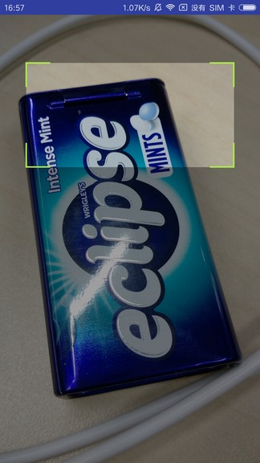
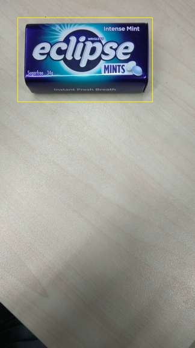
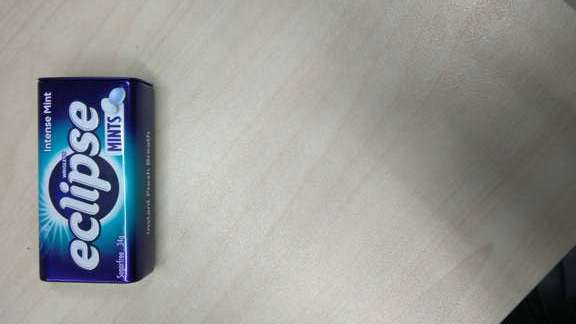
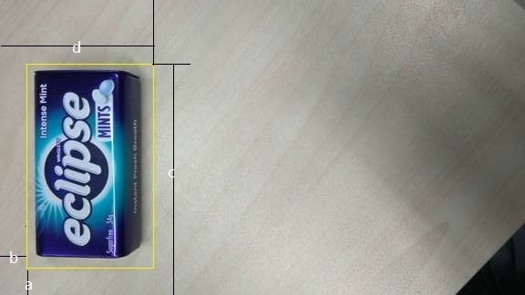
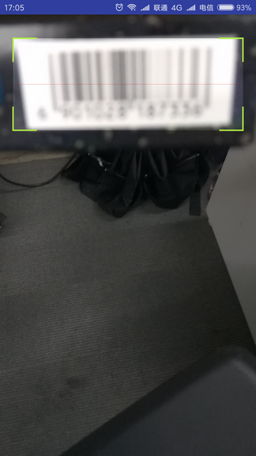
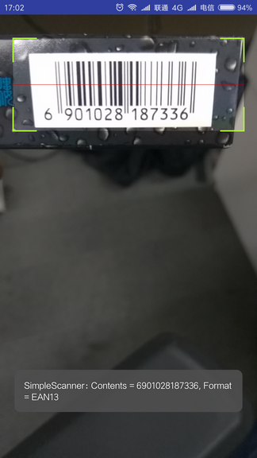

## 1 需求

公司的多款工具类app都用到了相机扫码功能。近一年来，由于业务的快速发展，业务方对扫码模块的性能也有了更高要求，主要是3个方面：

1. 由于使用中经常会遇到商品条码密集排列的情况，因此要求扫码识别区域要非常精确。举个例子，比如扫码界面中展示给用户的扫码框是一个200*100的矩形，那么真正被识别的图像数据就只能是这个矩形框中的内容。
2. 针对多个条码连续扫描识别的情形，要求每个条码的识别时间尽可能地短，这样使用起来效率更高，用户体验更好。
3. 扫码时相机的对焦区域(focus area)应该跟随视图中扫码框的位置和大小而变化，而不是始终位于预览画面中央（相机的默认设置）。

项目代码：[SimpleScanner](https://github.com/al4fun/SimpleScanner)

## 2 优化效果

为了方便查看扫码识别速度，我们在相机预览的回调方法onPreviewFrame中添加了如下代码来打印耗时：

```java
@Override
public void onPreviewFrame(byte[] data, Camera camera) {
	long startTime = System.currentTimeMillis();
	...

	//data数据处理及识别

	...
	Log.e("logg", String.format("图像处理及识别耗时: %d ms", System.currentTimeMillis() - startTime));
}
```

下面分别就扫描识别条形码、二维码，对本项目（SimpleScanner）和当前较为流行的扫码库barcodescanner （https://github.com/dm77/barcodescanner） 进行速度对比（测试平台为小米4，cpu为高通801）：

**条形码**

barcodescanner

```java
E/logg: 图像处理及识别耗时: 469 ms
E/logg: Contents = 1234567890123, Format = CODE128
E/logg: 图像处理及识别耗时: 439 ms
E/logg: Contents = 1234567890123, Format = CODE128
E/logg: 图像处理及识别耗时: 434 ms
E/logg: Contents = 1234567890123, Format = CODE128
E/logg: 图像处理及识别耗时: 446 ms
E/logg: Contents = 1234567890123, Format = CODE128
E/logg: 图像处理及识别耗时: 455 ms
E/logg: Contents = 1234567890123, Format = CODE128
E/logg: 图像处理及识别耗时: 439 ms
E/logg: Contents = 1234567890123, Format = CODE128
```

SimpleScanner

```java
E/logg: 图像处理及识别耗时: 22 ms
E/logg: Contents = 1234567890123, Format = CODE128
E/logg: 图像处理及识别耗时: 20 ms
E/logg: Contents = 1234567890123, Format = CODE128
E/logg: 图像处理及识别耗时: 22 ms
E/logg: Contents = 1234567890123, Format = CODE128
E/logg: 图像处理及识别耗时: 23 ms
E/logg: Contents = 1234567890123, Format = CODE128
E/logg: 图像处理及识别耗时: 23 ms
E/logg: Contents = 1234567890123, Format = CODE128
E/logg: 图像处理及识别耗时: 22 ms
E/logg: Contents = 1234567890123, Format = CODE128
```

**二维码**

barcodescanner

```java
E/logg: 图像处理及识别耗时: 448 ms
E/logg: Contents = 草料二维码, Format = QRCODE
E/logg: 图像处理及识别耗时: 469 ms
E/logg: Contents = 草料二维码, Format = QRCODE
E/logg: 图像处理及识别耗时: 453 ms
E/logg: Contents = 草料二维码, Format = QRCODE
E/logg: 图像处理及识别耗时: 473 ms
E/logg: Contents = 草料二维码, Format = QRCODE
E/logg: 图像处理及识别耗时: 511 ms
E/logg: Contents = 草料二维码, Format = QRCODE
E/logg: 图像处理及识别耗时: 461 ms
E/logg: Contents = 草料二维码, Format = QRCODE
```

SimpleScanner

```java
E/logg: 图像处理及识别耗时: 58 ms
E/logg: Contents = 草料二维码, Format = QRCODE
E/logg: 图像处理及识别耗时: 61 ms
E/logg: Contents = 草料二维码, Format = QRCODE
E/logg: 图像处理及识别耗时: 56 ms
E/logg: Contents = 草料二维码, Format = QRCODE
E/logg: 图像处理及识别耗时: 62 ms
E/logg: Contents = 草料二维码, Format = QRCODE
E/logg: 图像处理及识别耗时: 58 ms
E/logg: Contents = 草料二维码, Format = QRCODE
E/logg: 图像处理及识别耗时: 62 ms
E/logg: Contents = 草料二维码, Format = QRCODE
```

可见SimpleScanner相比barcodescanner基本能有90%左右的性能提升。虽然400ms并不起眼，但在实际使用中，一个是对焦即识别，另一个是对焦后要稍微停顿一下才能识别，对于连续多次扫码的使用场景，SimpleScanner的使用体验要明显更好。

## 3 项目结构简介

项目中比较重要的类主要有5个：

### ZBarScannerView

zbar扫码视图，可以直接在Activity中使用。

主要做了一件事：对相机预览的回调方法onPreviewFrame中的data(预览图像数据)进行一些预处理，并将处理后的数据交给zbar解码库去识别。

### BarcodeScannerView

基本扫码视图，是ZBarScannerView的父类。

主要包含了对相机预览的相关操作。同时，BarcodeScannerView也是一个视图容器（本质上是一个FrameLayout），包含了CameraPreview（相机预览画面）和ViewFinderView（覆盖在相机预览画面上层的扫码框、阴影遮罩等）。

### CameraPreview

这是一个SurfaceView，用于展示相机预览画面。

### ViewFinderView

覆盖在相机预览上层的view，包含扫码框、扫描线、扫码框周围的阴影遮罩等。

可以直接修改以下字段来改变ViewFinderView的外观：

```java
private float widthRatio = 0.8f;//扫码框宽度占view总宽度的比例
private float heightWidthRatio = 0.5f;//扫码框的高宽比
private int leftOffset = -1;//扫码框相对于左边的偏移量，若为负值，则扫码框会水平居中
private int topOffset = 200;//扫码框相对于顶部的偏移量，若为负值，则扫码框会竖直居中
private boolean isLaserEnabled = true;//是否显示扫描线
```

ViewFinderView本身的代码非常简单，并且与相机预览、扫码识别的逻辑几乎没有任何关联，因此修改起来十分容易。如果需要，可以自由地修改这个类来定制出自己需要的扫码界面。

ViewFinderView和CameraPreview的宽高都是match_parent，也就是说ViewFinderView和CameraPreview是等大的。

### SimpleScannerActivity

ZBarScannerView的使用方法示例。

## 4 主要优化点简介

这里只对主要的3个优化点做个简要介绍，具体细节请查看项目源码。

### （1）精确截取扫码识别区域

**通常做法：**



目前市面上大多数app对于扫码识别区域的处理方式都是：将整个预览图像交给核心解码库（即zbar或zxing）进行识别。也就是说（如上图所示），虽然在屏幕偏上方有一个扫码框，用户也会自然而然地将要扫的条码放到扫码框区域之内，但实际上，在app内部，传递给核心解码库进行识别的，是整个预览画面。

这种处理方式的好处是代码逻辑非常简单，而缺点有两个：

- 首先是上面提到过的那种场景，当有多个排列较为紧密的条码，而你只想识别其中的某一个时，操作起来会比较困难。
- 第二，因为传递给核心解码库的是整个预览画面，数据量较大，因此识别速度也会较慢。

**优化：**

```java
public Rect getScaledRect(int previewWidth, int previewHeight) {
    if (scaledRect == null) {
        Rect framingRect = mViewFinderView.getFramingRect();//获得扫码框区域
        int viewFinderViewWidth = mViewFinderView.getWidth();
        int viewFinderViewHeight = mViewFinderView.getHeight();

        int width, height;
        if (DisplayUtils.getScreenOrientation(getContext()) == Configuration.ORIENTATION_PORTRAIT//竖屏使用
                && previewHeight < previewWidth) {
            width = previewHeight;
            height = previewWidth;
        } else if (DisplayUtils.getScreenOrientation(getContext()) == Configuration.ORIENTATION_LANDSCAPE//横屏使用
                && previewHeight > previewWidth) {
            width = previewHeight;
            height = previewWidth;
        } else {
            width = previewWidth;
            height = previewHeight;
        }

        scaledRect = new Rect(framingRect);
        scaledRect.left = scaledRect.left * width / viewFinderViewWidth;
        scaledRect.right = scaledRect.right * width / viewFinderViewWidth;
        scaledRect.top = scaledRect.top * height / viewFinderViewHeight;
        scaledRect.bottom = scaledRect.bottom * height / viewFinderViewHeight;
    }

    return scaledRect;
}
```

要明白这个方法的含义，首先需要知道的是（如上图所示）：虽然相机预览画面（CameraPreview）和上层的ViewFinderView大小一样，但实际上，系统传递给我们的预览图像数据（也就是onPreviewFrame方法的data参数），其尺寸与ViewFinderView的尺寸通常是不同的。因此，为了在预览图像数据中截取正确的区域，我们必须根据预览图像数据和ViewFinderView的尺寸之比对扫码框区域进行缩放。举个简单的例子：假设ViewFinderView的尺寸是`1280*720`，扫码框的尺寸是`100*200`，而预览图像数据的尺寸是`2560*1440`，那么，要想实际截取的区域与我们所看到的区域一致，我们就必须用一个`200*400`的矩形框去预览图像数据中截取。也就是说，如果预览图像数据的尺寸是ViewFinderView的尺寸的两倍，那么我们用来截取预览图像数据的矩形框的尺寸也应该是ViewFinderView中扫码框尺寸的两倍。

上面`getScaledRect(int previewWidth, int previewHeight)`方法所做的事情就是根据ViewFinderView和预览图像数据的尺寸之比，对扫码框的矩形区域进行缩放。

- 方法的参数previewWidth和previewHeight就是预览图像数据的宽和高。
- `mViewFinderView.getFramingRect()`获得的是扫码框在ViewFinderView中的矩形区域。

### （2）提高识别速度

事实上，要使实际截取的区域与我们所看到的区域一致，仅仅像上面那样缩放扫码框是不够的。这是因为，系统传递给我们的预览图像数据不仅尺寸可能会与ViewFinderView不同，其方向通常也与窗口的方向不同。比如，我们看到的预览图像是下面这样的(图中的黄色框是我画的扫码框示意，你可以把薄荷糖盒子想象成要扫的条码)：



而实际上，系统传递给我们的预览图像数据很可能是这样的：



显然，在这种情况下，如果你直接拿缩放后的矩形框去预览图像数据中截取，那就完全截错了地方。那该怎么办呢？有两种解决办法可供选择：

1. 将图像数据顺时针旋转90度
2. 将矩形框逆时针旋转90度

目前我所知的扫码库采用的都是第一种办法，即将图像数据顺时针旋转90度，代码如下：

```java
public byte[] rotateData(byte[] data, Camera camera) {
    Camera.Parameters parameters = camera.getParameters();
    int width = parameters.getPreviewSize().width;
    int height = parameters.getPreviewSize().height;

    int rotationCount = getRotationCount();
    for (int i = 0; i < rotationCount; i++) {
        byte[] rotatedData = new byte[data.length];
        for (int y = 0; y < height; y++) {
            for (int x = 0; x < width; x++)
                rotatedData[x * height + height - y - 1] = data[x + y * width];
        }
        data = rotatedData;
        int tmp = width;
        width = height;
        height = tmp;
    }

    return data;
}
```

简单的说，就是根据位置关系对图像数据中的每一个点进行映射赋值。对于尺寸为`1920*1080`的图像预览数据，`rotatedData[x * height + height - y - 1] = data[x + y * width]`这样的运算要重复200多万次，这显然是一个十分耗时的过程。

而另一种选择就是将矩形框逆时针旋转90度，其代码如下：

```java
public Rect getRotatedRect(int previewWidth, int previewHeight, Rect rect) {
    if (rotatedRect == null) {
        int rotationCount = getRotationCount();
        rotatedRect = new Rect(rect);

        if (rotationCount == 1) {//若相机图像需要顺时针旋转90度，则将扫码框逆时针旋转90度
            rotatedRect.left = rect.top;
            rotatedRect.top = previewHeight - rect.right;
            rotatedRect.right = rect.bottom;
            rotatedRect.bottom = previewHeight - rect.left;
        } else if (rotationCount == 2) {//若相机图像需要顺时针旋转180度,则将扫码框逆时针旋转180度
            rotatedRect.left = previewWidth - rect.right;
            rotatedRect.top = previewHeight - rect.bottom;
            rotatedRect.right = previewWidth - rect.left;
            rotatedRect.bottom = previewHeight - rect.top;
        } else if (rotationCount == 3) {//若相机图像需要顺时针旋转270度，则将扫码框逆时针旋转270度
            rotatedRect.left = previewWidth - rect.bottom;
            rotatedRect.top = rect.left;
            rotatedRect.right = previewWidth - rect.top;
            rotatedRect.bottom = rect.right;
        }
    }

    return rotatedRect;
}
```

旋转矩形框的原理很简单，假设矩形框的left、top、right、bottom分别为a、b、c、d，如下图所示：


以下面这种方向的预览图像数据为例：


我们需要得到下面这样的一个矩形框，也就是将矩形框逆时针旋转了90度：



由图可知旋转前后矩形框的对应关系为：

|--|left|top|right|bottom|
|--|--|--|--|--|
|旋转前|a|b|c|d|
|旋转后|b|height-c|d|height-a|

有了这张表格那么下面这段代码就很容易理解了：

```java
if (rotationCount == 1) {//若相机图像需要顺时针旋转90度，则将扫码框逆时针旋转90度
    rotatedRect.left = rect.top;
    rotatedRect.top = previewHeight - rect.right;
    rotatedRect.right = rect.bottom;
    rotatedRect.bottom = previewHeight - rect.left;
}
```

需要注意的是：第二种处理方法（旋转矩形框，而不旋转预览图像数据）只适用核心解码库为zbar的情形。如果核心解码库为zxing，由于zxing不能识别竖直排列的条形码，因此只能采用旋转预览图像数据这种方式。

### （3）根据扫码框的位置和大小调整相机的对焦区域

在实际应用中，扫码页中除了扫码框之外，可能还需要放入很多其他内容（如文字、列表、按钮等），因此有时候扫码框并不位于界面中央，比如在我们的一个app中，扫码框就是位于画面中十分偏上的位置。另一方面，android相机默认是以预览画面的中央为目标来调整焦距的，这就会造成一个问题，如下图所示：



近处是一个香烟盒的侧面，上面有一个条形码；远处是雨伞和地面。我们将香烟盒放在扫码框中是想要扫取香烟盒上的条形码，然而因为地面和雨伞位于画面中央，因此相机便将焦点放在了地面和雨伞上，结果就是近处的香烟盒因为失焦而模糊，上面的条形码自然也就无法被正常地识别。

为了解决这一问题，我们需要将扫码框所在的区域作为相机的对焦区域。Camera.Parameters提供了`setFocusAreas (List<Camera.Area> focusAreas)`方法来实现这一功能。

在定义对焦区域的时候需要注意，这里坐标系的(0,0)位于预览画面的中央，预览画面左上角的坐标为(-1000,-1000)，预览画面右下角的坐标为(1000,1000)，如下图所示：


基于与上面优化点(1)、(2)中一样的原理，这里我们也需要通过对扫码框区域做缩放和旋转操作来得到对应的对焦区域，但是这样还不够，因为对焦区域坐标系的坐标原点在画面中央，左上角为(-1000,-1000)，我们还需要对缩放、旋转后的区域进行平移。

设置对焦区域的主要代码如下：

```java
/**
 * 设置对焦区域
 */
private void setupFocusAreas() {
    /*
     * 1.根据ViewFinderView和2000*2000的尺寸之比，缩放对焦区域
     */
    Rect framingRect = viewFinderView.getFramingRect();//获得扫码框区域
    int viewFinderViewWidth = viewFinderView.getWidth();
    int viewFinderViewHeight = viewFinderView.getHeight();
    int width = 2000, height = 2000;

    Rect scaledRect = new Rect(framingRect);
    scaledRect.left = scaledRect.left * width / viewFinderViewWidth;
    scaledRect.right = scaledRect.right * width / viewFinderViewWidth;
    scaledRect.top = scaledRect.top * height / viewFinderViewHeight;
    scaledRect.bottom = scaledRect.bottom * height / viewFinderViewHeight;

    /*
     * 2.旋转对焦区域
     */
    Rect rotatedRect = new Rect(scaledRect);
    int rotationCount = getRotationCount();
    if (rotationCount == 1) {//若相机图像需要顺时针旋转90度，则将扫码框逆时针旋转90度
        rotatedRect.left = scaledRect.top;
        rotatedRect.top = 2000 - scaledRect.right;
        rotatedRect.right = scaledRect.bottom;
        rotatedRect.bottom = 2000 - scaledRect.left;
    } else if (rotationCount == 2) {//若相机图像需要顺时针旋转180度,则将扫码框逆时针旋转180度
        rotatedRect.left = 2000 - scaledRect.right;
        rotatedRect.top = 2000 - scaledRect.bottom;
        rotatedRect.right = 2000 - scaledRect.left;
        rotatedRect.bottom = 2000 - scaledRect.top;
    } else if (rotationCount == 3) {//若相机图像需要顺时针旋转270度，则将扫码框逆时针旋转270度
        rotatedRect.left = 2000 - scaledRect.bottom;
        rotatedRect.top = scaledRect.left;
        rotatedRect.right = 2000 - scaledRect.top;
        rotatedRect.bottom = scaledRect.right;
    }

    /*
     * 3.坐标系平移
     */
    Rect rect = new Rect(rotatedRect.left - 1000, rotatedRect.top - 1000, rotatedRect.right - 1000, rotatedRect.bottom - 1000);

    /*
     * 4.设置对焦区域
     */
    Camera.Parameters parameters = cameraWrapper.camera.getParameters();
    if (parameters.getMaxNumFocusAreas() > 0) {
        Camera.Area area = new Camera.Area(rect, 1000);
        ArrayList<Camera.Area> areaList = new ArrayList<>();
        areaList.add(area);
        parameters.setFocusAreas(areaList);
        cameraWrapper.camera.setParameters(parameters);
    } else {
        Log.e(TAG, "不支持设置对焦区域");
    }

    Log.e(TAG, "对焦区域：" + rect.toShortString());
}
```

这当中涉及的细节比较多，限于篇幅原因就不再细说了，如果希望更一进步了解的话可以参考Camera的官方文档中关于对焦区域的部分（[这里有我之前翻译的一个中文版](https://blog.csdn.net/al4fun/article/details/78517644)）以及`Camera.Parameters.getFocusAreas()`方法的官方文档。

经过以上调整，我们便可以得到一个正确的对焦效果了，如下图所示：



当扫码框的位置和大小变化时，对焦区域也会跟着变化。

## 5 最后

相机扫码涉及的知识点比较多，限于篇幅无法在此一一讲清。建议有兴趣深入的朋友先对Camera类、相机预览机制、各种方向的概念(窗口方向、设备自然方向、相机方向)等做一个大概了解，然后再去阅读本项目（SimpleScanner）的源码。

当然，即便没有阅读源码，你也可以很容易地将本项目移植到你自己的app中使用——只需要修改ViewFinderView类来定制你需要的扫码界面即可。具体使用方式参考SimpleScannerActivity类。

## 参考

- Camera官方文档：https://developer.android.com/guide/topics/media/camera.html
- barcodescanner：https://github.com/dm77/barcodescanner